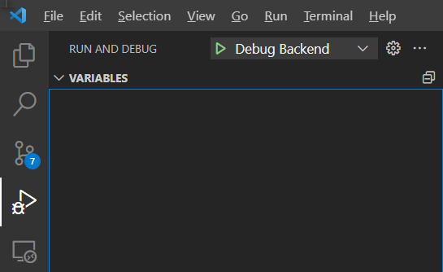

# Get Started

## Background knowledge

- Typescript
- Node.js

## Prerequisites

1. Node.js
2. npm
3. [lerna](https://lerna.js.org/#getting-started)

## Setup

1. clone the repository

```shell
git clone https://github.com/Combo819/social-media-archiver.git
```

2. install dependencies  
   For `npm<=6`:

```shell
cd social-media-archiver
npm ci
lerna bootstrap
```

For `npm>=7`:

```shell
cd social-media-archiver
npm ci --legacy-peer-deps
```

## Config

In `packages/backend/src/Config/constants.ts`:

```typescript
const BASE_URL: string = 'PLATFORM_DOMAIN';
const Q_CONCURRENCY: number = 1; // number of concurrent API requests to the platform
const MAX_ITEM_WINDOW: number = 6; // max number of API requests to the platform in a 30s window
```

## Run

Start both the frontend and backend by running:

```shell
npm run start
```

By default, the fronend will run on port `3000` and the backend will run on port `5000`.  
The API call from the frontend will be proxied to the port `5000`.
Thus, if you are doing the frontend development, make sure the backend is running on port `5000`.  
When you see

```log
@social-media-archiver/backend: Development mode, Listening on port 5000
```

Then the backend is running.

## Debug

To debug the backend, stop the running backend first, and open the debug panel in VS Code,
select the `Debug Backend` in the dropdown, and click the `Start Debugging` button.



Then you can use the debug utilities like breakpoints and the debug message is displayed in the Debug Console right next to Terminal.

## Log

In development mode, the log will be displayed in the terminal or the debug console(for VS Code debug mode). There is also a log file `packages/backend/log/social-media-archiver.log`  
In production mode, the log file is in `log/social-media-archiver.log`.
You can use [pino-pretty](https://github.com/pinojs/pino-pretty) to pretty print the log file.

## Commit
This repository use `git-cz`. Run `npm run commit` to commit the changes to the repository. It will generate a commit message template for you.

## Tech stack
+ Frontend: [React](https://reactjs.org/)
+ UI: [Ant Design](https://ant.design/)
+ Server: [Express](https://expressjs.com/)
+ Html Manipulation: [cheerio](https://cheerio.js.org/)
+ Inversion of Control: [inversify](https://inversify.io/)
+ Flow Control: [async](https://caolan.github.io/async/v3/)
+ Database: [rxdb](https://rxdb.info/)
+ Packaging: [pkg](https://github.com/vercel/pkg)